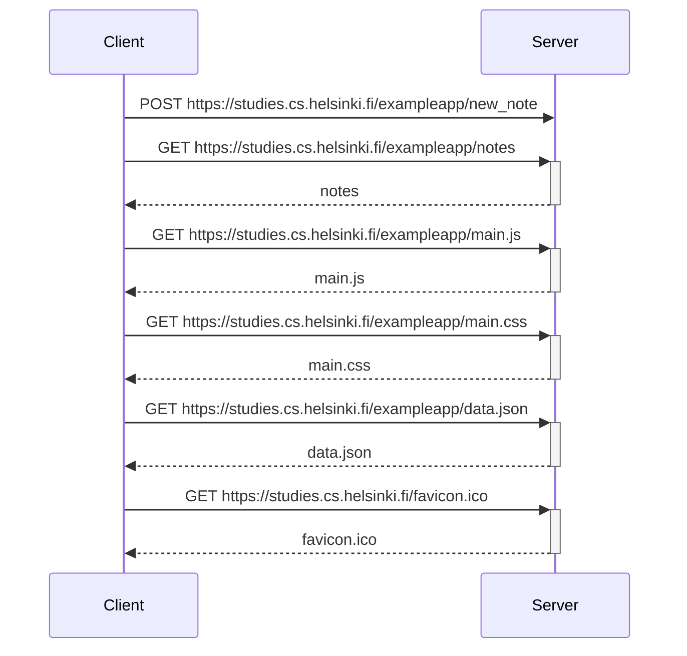

```mermaid
sequenceDiagram
  participant Client
  participant Server
  
  Client->>Server:POST https://studies.cs.helsinki.fi/exampleapp/new_note
  Client->>+Server:GET https://studies.cs.helsinki.fi/exampleapp/notes
  Server-->>-Client:notes
  Client->>+Server:GET https://studies.cs.helsinki.fi/exampleapp/main.js
  Server-->>-Client:main.js
  Client->>+Server:GET https://studies.cs.helsinki.fi/exampleapp/main.css
  Server-->>-Client:main.css
  Client->>+Server:GET https://studies.cs.helsinki.fi/exampleapp/data.json
  Server-->>-Client:data.json
  Client->>+Server:GET https://studies.cs.helsinki.fi/favicon.ico
  Server-->>-Client:favicon.ico
```
